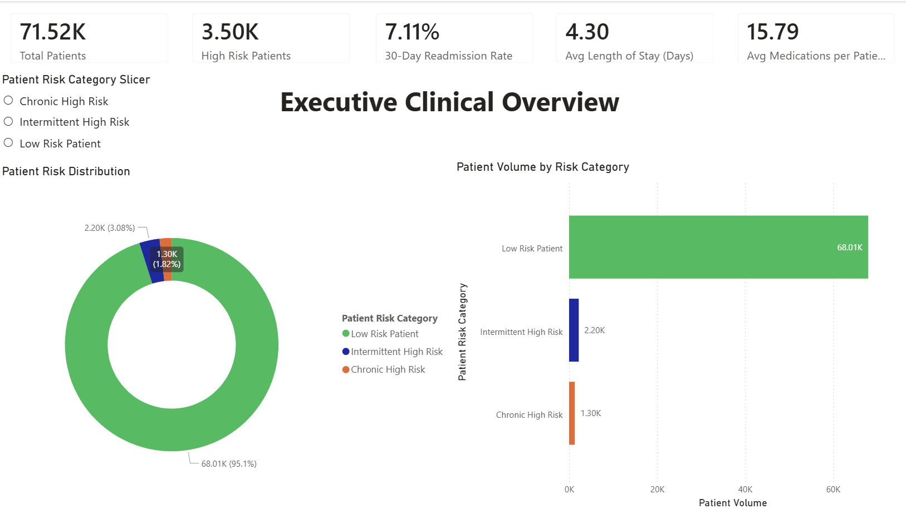
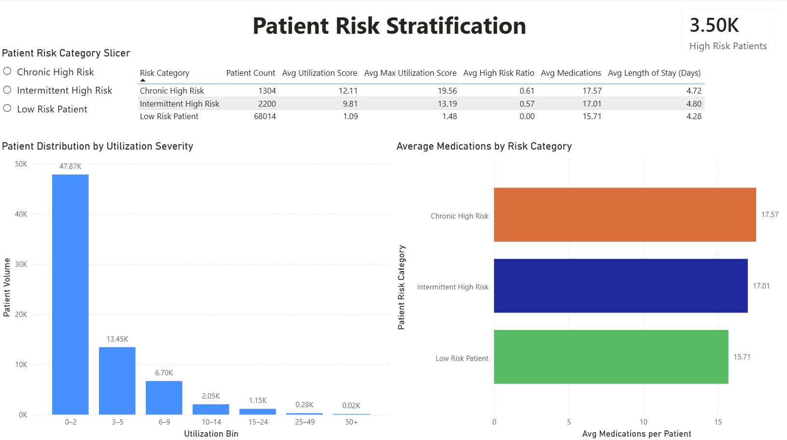
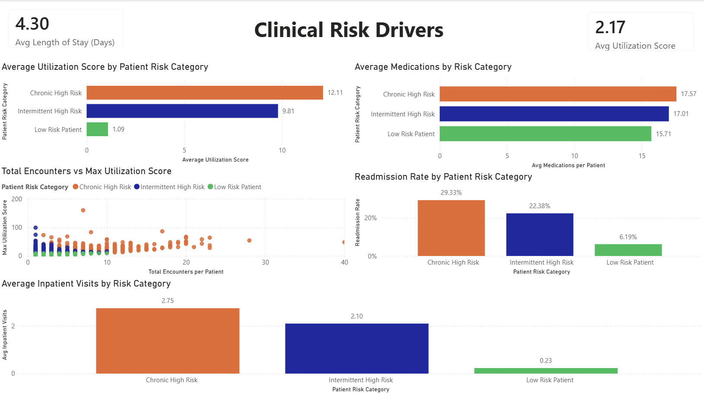
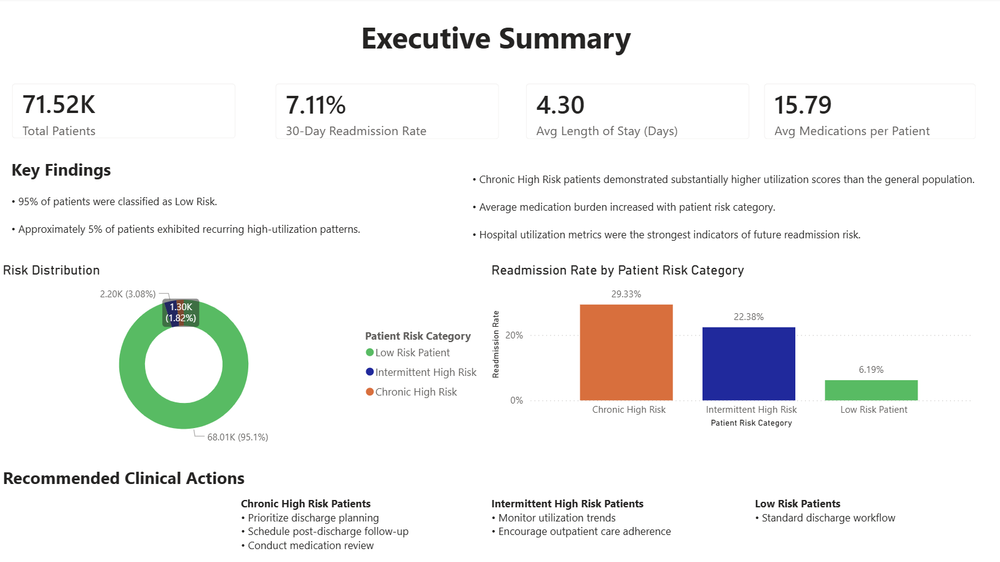

# Hospital Readmission Risk Prediction & Utilization Analysis: Diabetes

## Project Overview

This project analyzes 30-day hospital readmissions among diabetes patients using the Diabetes 130-US hospitals (1999–2008) dataset.

What started as a fairly standard classification problem gradually turned into something a bit more interesting to me:

> Understanding what hospital readmission risk is actually capturing inside a real healthcare system.

Across exploratory analysis, statistical testing, and early modeling, a consistent pattern kept showing up:

> Patients with higher prior healthcare utilization, especially inpatient history, tend to have higher readmission risk.

That observation is not framed as causation, but it has become the central thread of the project so far.

---

## Business Problem

> What factors are associated with 30-day hospital readmissions among diabetes patients?

Hospital readmissions are an important healthcare quality metric because they can reflect:
- gaps in care coordination
- poor chronic disease management
- high patient complexity
- discharge planning issues
- increased healthcare costs

In this project, I am focusing on:
- exploring patterns associated with 30-day readmissions
- understanding utilization trends
- identifying possible risk indicators
- evaluating whether patterns are consistent across statistical + ML methods
- preparing the data for future reporting and modeling work

---

## Dataset

**Dataset:**  
[Diabetes 130-US hospitals for years 1999–2008](https://www.kaggle.com/datasets/brandao/diabetes)

**Source:**  
[Kaggle](https://www.kaggle.com/datasets/brandao/diabetes)

The dataset contains over 100,000 hospital encounters from 130 U.S. hospitals and includes:
- demographics
- diagnoses
- medications
- utilization history
- admission/discharge information
- limited lab result information

---

## Notebook Analysis Work

Most of the early exploration for this project was done on my local system and in a Kaggle Notebooks before I moved things over into this GitHub repo.

**Kaggle Notebooks:**

- [01_eda](https://www.kaggle.com/code/datascienceam/diabetes-readmission-risk-01-eda)

- [02_feature_engineering](https://www.kaggle.com/code/datascienceam/diabetes-readmission-risk-02-feature-engineering)

- [03_stat_analysis](https://www.kaggle.com/code/datascienceam/diabetes-readmission-risk-03-stat-analysis)

- [04_ modeling](https://www.kaggle.com/code/datascienceam/diabetes-readmission-risk-04-modeling)

Note on Reproducibility: Minor variations in results may occur due to environment differences (local vs Kaggle), but overall findings remain consistent across runs.

The Kaggle notebooks and on my local system  are where I worked through the messy part of the analysis, getting a feel for the data, testing cleaning decisions, and doing some quick visual checks to understand what was going on.

This GitHub version is a cleaner, more structured write-up of that same process, with everything organized so it’s easier to follow and reproduce.

---

## Work Completed So Far (Summary)

### Python Phase (Days 1–9)
- EDA and data cleaning
- Feature engineering (~2418 features after encoding)
- Statistical testing (chi-square, t-tests)
- Baseline + Random Forest + XGBoost models
- Threshold tuning and precision-recall analysis

### SQL Phase (STARTED Day 10)
Completed SQL files:
- `01_data_exploration.sql`
- `02_readmission_metrics.sql`
- `03_utilization_analysis.sql`
- `04_risk_cohorts.sql`
- `05_feature_engineering.sql`
- `06_dashboard_views.sql`
- `07_patient_risk_summary.sql`

---

## Current Progress (End of Day 17)

### Power BI Dashboard Development (Completed)

After completing the SQL feature engineering and risk scoring layers, I shifted focus toward reporting and visualization.

The goal was to translate the findings from the Python modeling work and SQL analysis into a dashboard that could be used by a hospital operations or population health team.

Rather than building visuals directly from encounter-level records, I created a patient-level summary layer in PostgreSQL:

`patient_risk_summary`

This table aggregates utilization and risk information across patient encounters and serves as the primary reporting dataset for Power BI.

### Dashboard Pages Created

#### Page 1 — Executive Clinical Overview
#### Page 2 — Patient Risk Stratification
#### Page 3 — Clinical Risk Drivers
#### Page 4 — Executive Summary

### Biggest Finding So Far

One pattern has remained remarkably consistent throughout every stage of the project:

> Patients with greater prior healthcare utilization tend to experience substantially higher readmission risk.

This pattern appeared in:

- EDA
- statistical testing
- Logistic Regression
- Random Forest
- XGBoost
- SQL validation
- dashboard reporting

I am treating this as a strong observational finding rather than evidence of causation.

---

# Power BI Dashboard Preview

One of the goals of this project was to move beyond model outputs and create something that resembles how healthcare analytics findings might actually be consumed by decision-makers.

After completing the SQL feature engineering and patient risk scoring layers, I built a four-page Power BI dashboard focused on:

- patient risk stratification
- healthcare utilization patterns
- readmission monitoring
- executive-level reporting

The dashboard is powered by SQL-generated patient risk tables and summarizes both utilization behavior and modeled risk indicators.

---

## Page 1 - Executive Clinical Overview

This page provides a high-level summary of the patient population and key readmission metrics.

Highlights include:

- total patient population
- high-risk patient counts
- 30-day readmission rate
- average length of stay
- medication burden
- patient risk distribution



---

## Page 2 - Patient Risk Stratification

This page focuses on how patients separate across risk categories generated from utilization-based scoring.

Key views include:

- patient counts by risk segment
- utilization score comparisons
- average medication burden
- average length of stay
- utilization severity distributions



---

## Page 3 - Clinical Risk Drivers

This page explores the variables most strongly associated with elevated patient risk.

Visuals examine:

- utilization score differences
- medication burden
- inpatient visit behavior
- encounter frequency
- readmission rates across risk categories

One of the most consistent findings throughout the project appears again here:

> patients with greater prior healthcare utilization generally exhibit higher readmission risk.



---

## Page 4 - Executive Summary

The final page consolidates key findings into a presentation-style summary intended for non-technical stakeholders.

It combines:

- major project KPIs
- risk distribution summaries
- readmission comparisons
- recommended clinical actions

This page was designed to simulate the type of summary view that healthcare leadership teams might review during operational reporting.



---

### Dashboard Development Notes

Building the dashboard ended up being one of the more challenging parts of the project.

A significant portion of the work involved:

- designing SQL aggregation layers
- creating patient-level risk scoring tables
- troubleshooting Power BI relationships and refresh issues
- translating analytical findings into business-facing metrics

The dashboard is not intended to be a production clinical tool, but rather a demonstration of how predictive modeling, SQL analytics, and BI reporting can be combined into a single healthcare analytics workflow.

---

## EDA

Early Observations:

Some early patterns I noticed during exploratory analysis:

- Patients with more inpatient visits appear more likely to be readmitted
- Emergency visit history also seems important
- Readmitted patients had slightly longer hospital stays on average
- Several variables contain very high missingness
- Medication counts are higher among readmitted patients
- The dataset has noticeable class imbalance (~11% readmitted within 30 days)

One thing that surprised me was that the 20–30 age group showed a relatively high readmission rate. I still need to investigate whether that is meaningful or caused by something else in the data.

Challenges So Far:

A few real challenges that shaped how I approached this project:

- High class imbalance (~11% readmitted)
- Very high dimensional feature space after encoding
- Many categorical variables with large cardinality (especially diagnosis codes)
- Missing data is uneven and sometimes likely informative


---

## Feature Engineering Notes

This stage ended up being more complex than expected.

Main steps:
- Dropped identifier columns (`encounter_id`, `patient_nbr`)
- Removed near-constant variables
- Encoded categorical variables using one-hot encoding
- Handled missing values implicitly through encoding

### Key challenge:
One-hot encoding significantly increased feature space (~2418 columns), mainly due to:
- diagnosis codes (high cardinality)
- medical specialty
- medication variables

This is something I may revisit later if model performance or interpretability becomes an issue.

---

Statistical Analysis Findings

I used:
- Chi-square tests for categorical variables
- T-tests for numerical variables

Strongest findings:
- Prior inpatient visits had the clearest relationship with readmission
- Utilization-related variables consistently outperformed demographics
- Length of stay was statistically significant but practically smaller than expected
- Large sample size produced many small p-values, which made practical interpretation important

One thing I started thinking more about during this phase:

statistical significance does not automatically mean healthcare importance

That became increasingly important as I move throughout the project.

---

## Modeling Work

### Model performance summary:

- Logistic Regression: baseline signal detection
- Random Forest: weak minority recall
- XGBoost: best ranking performance (~0.69 ROC-AUC)
- Precision-recall analysis showed threshold dependency is critical

---

## Limitations

This is important to acknowledge:

- Readmission definition is simplified into a binary target
- No distinction between planned vs unplanned readmissions
- No time-series structure (all data treated as static snapshots)
- Potential confounding between severity and utilization variables
- Dataset reflects hospital systems, not just patient health

---

## Tools Used

- Python (pandas, numpy, scipy, sklearn, matplotlib, seaborn) 
- Jupyter Notebook
- PostgreSQL (pgAdmin4)
- Excel

---

## Repository Structure

```
diabetes-readmission-risk/
- README.md
- data_dictionary.md
- methodology.md
- data_understanding.md
- requirements.txt
- data/
- notebooks/
- sql/
```

Note: The fully encoded feature dataset (`diabetic_features.csv`) is not included in the repository due to file size constraints. It can be recreated by running `02-feature-engineering.ipynb`.
